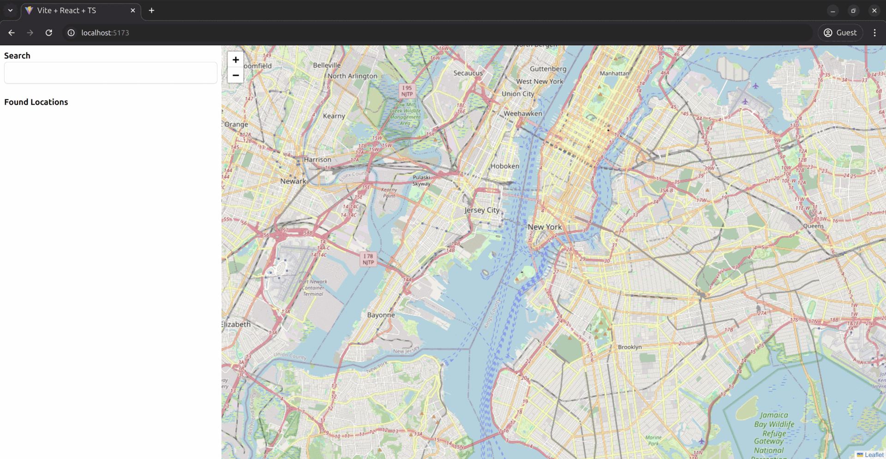

# Map Explorer

A React-based interactive map application that allows users to search for locations and view them on an interactive OpenStreetMap interface. Try it live at [https://thedevdevesh-map-explorer.netlify.app/](https://thedevdevesh-map-explorer.netlify.app/) an OpenStreetMap interface.




## Features

- 🔍 Location search functionality
- 🗺️ Interactive OpenStreetMap integration
- 📍 Marker placement for selected locations
- 🚀 Smooth map animations
- 💻 Responsive design with Tailwind CSS

## Technologies Used

- React 18
- TypeScript
- Vite
- Leaflet / React Leaflet
- Tailwind CSS
- ESLint
- PostCSS

## Getting Started

### Prerequisites

- Node.js (v14 or higher)
- npm or yarn

### Installation

1. Clone the repository
```bash
git clone https://github.com/thedevdevesh/MapExplorer.git
cd map-explorer
```

2. Install dependencies
```bash
npm install
# or
yarn
```

3. Start the development server
```bash
npm run dev
# or
yarn dev
```

4. Open [http://localhost:5173](http://localhost:5173) in your browser

### Building for Production

```bash
npm run build
# or
yarn build
```

The built files will be in the `dist` directory.

## Usage

1. Enter a location name in the search box
2. Press Enter
3. From the search results, click "Go" on your desired location
4. The map will smoothly animate to the selected location and place a marker

## Project Structure

```
map-explorer/
├── src/
│   ├── api/          # API integration
│   ├── components/   # React components
│   │   ├── LocationSearch.tsx
│   │   └── Map.tsx
│   └── App.tsx      # Main application component
├── public/          # Static assets
└── ...config files
```

## Contributing

1. Fork the repository
2. Create your feature branch (`git checkout -b feature/AmazingFeature`)
3. Commit your changes (`git commit -m 'Add some AmazingFeature'`)
4. Push to the branch (`git push origin feature/AmazingFeature`)
5. Open a Pull Request


## Acknowledgments

- OpenStreetMap for providing the map tiles
- Leaflet for the mapping library
- React Leaflet for React components
